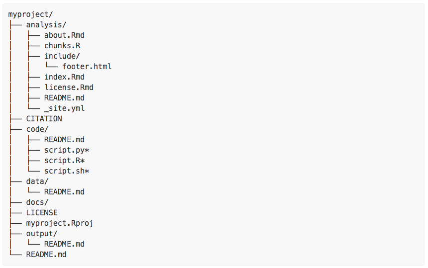
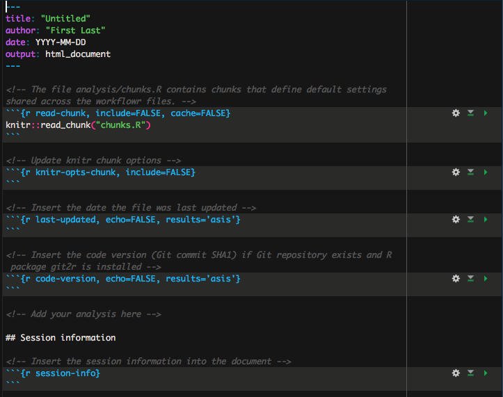
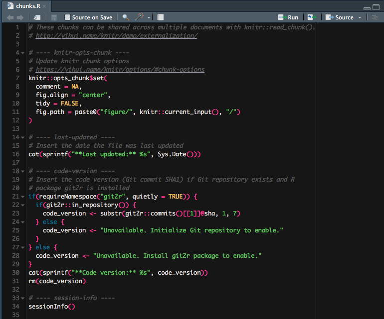

```{r setup, include=FALSE}
options(htmltools.dir.version = FALSE)
```


# outline

## Demo of **John Blischak's** ([@jdblischak](https://twitter.com/jdblischak)) awesome [`workflowr`](https://github.com/jdblischak/workflowr) package

- background
- demo of setting up a new projects
- demo of a populated project


---

# building on the shoulders of giants

- Git
- [pandoc](http://pandoc.org/)
- [knitr]()
- Rstudio projects

---
background-image: url(http://www.deucecitieshenhouse.com/images/2015/08.31/6.jpg)
background-size: cover
class: left, top, inverse


#  **Tidy projects**

- ## **Project organisation**

- ## **Project management**

- ## **Project documentation**


---
# Project organisation

- Encourages tidy practices


---

# A sensible starting file system setup




---
# Customisable

### ** DO NOT TOUCH!**
Project site depends on the following files:

- **`analysis/`**
- **`docs/`**
- **`.Rproj` file**

### **Everything is else is game**

<br>

Adapt to suit your own project organisation needs/preferences

---
# Project management

building on Git version control system

- git resources
- 


---
# Project documentation

Building on `knitr` & `rmarkdown`
- Analyses in `.Rmd` live in **`analysis/`**
- render to `html`
- push to github


---

# Project website

- Develop content in `.Rmd` documents in the **`analysis/`** dir

- `Rmd` automatically rendered to `html` in the **`docs/`** dir

- When pushed to github [**`docs/` can be set as the publishing source for gh-pages**](https://help.github.com/articles/configuring-a-publishing-source-for-github-pages/#publishing-your-github-pages-site-from-a-docs-folder-on-your-master-branch) folder


---

# Elements of the website

### **_site.yml:** a master yaml header for the whole site
- change the theme
- modify the structure of the site `index` banner
- modify the table of contents

### **index.Rmd**
- landing page for the project
    - add links to further analysis pages here
    
---

# Elements of the website

### **about.Rmd** 
- used to provide a description of yourself / your group

### **license.Rmd** 
- very important to include an appropriate license [(quick guide)](http://journals.plos.org/ploscompbiol/article?id=10.1371/journal.pcbi.1002598)

### **license.Rmd** 

- important for correct attribution and citation of your code (consider getting a DOI)

<br>

Again, customisable through **adding pages** and updating the **`_site.yml`**

---
# Elements of an analysis page

Begins with an **`.Rmd` template**



---
# Elements of an analysis page

Calls default chunks in **`analysis/chunks.R`** using `knitr::read_chunk(chunks.R)`




---
# Elements of an analysis page

The rest of any analysis `.Rmd` serves to promote good practice in encouraging 
### Literate programming:
ie **making your analyses (your code, inputs and outputs) understandable to humans**
- code can still be stored separately in dir **`code/`** and either:
    - **sourced** using **`source(code/script.R)`**
    - **read in** using **`read_chunk(code/script.R)`**  and called using the chunk name

---

# Start a new project

# [Before you start!](https://jdblischak.github.io/workflowr/index.html)

**Requirements:**
Need :
- R (ideally also RStudio) installed
- [Git installed](https://swcarpentry.github.io/workshop-template/#git) + GitHub account created
- package **`workflowr`** installed

- set the Git variables `user.name` and `user.email` to your **GitHub user name** and **login email**
```
git config --global user.name "your-github-username"
git config --global user.email "youremail@domain"
```

(you can run `git config -l` in the shell to confirm).


---
class: center, center, inverse

# Key functions
---

## start a new `workflowr` project

```{r eval=FALSE}
wflow_start("path-to-project/name-of-project")
```

- creates directories and templates
- initialises git

<br>


*TIP: Head to the project folder in Rstudio projects at this point, nicer to work from there*


---

# build and view your project website

### build site

```{r eval=FALSE}

wflow_build()
```

### view site

```{r eval=FALSE}

wflow_view()

```

---

# check status of site

tracks unpublished and changes to published `.Rmd`s

```{r, eval =FALSE}
wflow_status()
```

---

# publish your site

```{r, eval =FALSE}

wflow_publish(c("analysis/index.Rmd", "analysis/about.Rmd", "analysis/license.Rmd"),
              "Publish the initial files for project")
```

### 3 steps in the process:

- **Step 1: Commits the 3 R Markdown files** using the custom commit message

- **Step 2: Builds the HTML files** using `wflow_build()`

- **Step 3: Commits the 3 HTML files** plus the files that specify the style of the website (e.g. CSS and Javascript files)

Performing these 3 steps **ensures that the HTML files are always in sync with the latest versions of the R Markdown files**.

---


# deploy site

## First link your local repository to a remote repository on github

- **log into github**
- **create a repository** ([instructions](https://help.github.com/articles/creating-a-new-repository/))
    - *do not add an automatically-generated README, .gitignore, or license as `workflowr` has already taken care of that.*
- In the terminal run:

```
git remote add origin https://github.com/myname/myproject.git
```

## push your changes up to GitHub
    
```
 git push -u origin master
```

---

# add a new analysis file

```{r, eval=F}
wflow_open("first-analysis.Rmd")
```


### Does 3 things:

- Creates a new file `analysis/first-analysis.Rmd` based on the workflowr R Markdown template (it doesn’t overwrite the file if it already exists)

- Sets the working directory to the `analysis/` directory

- If you are using RStudio, opens the file for editing


---
class: center, middle, inverse

# Examples in the wild:

.left[
- live demo ([vignette]())
- populated [example](https://github.com/annakrystalli/news-scrape)]

---
class: center, middle, inverse

# Questions?

<br>

.footnote[**github:** [@annakrystalli](https://github.com/annakrystalli) <br> **twitter:** [@annakrystalli](https://twitter.com/annakrystalli)]

